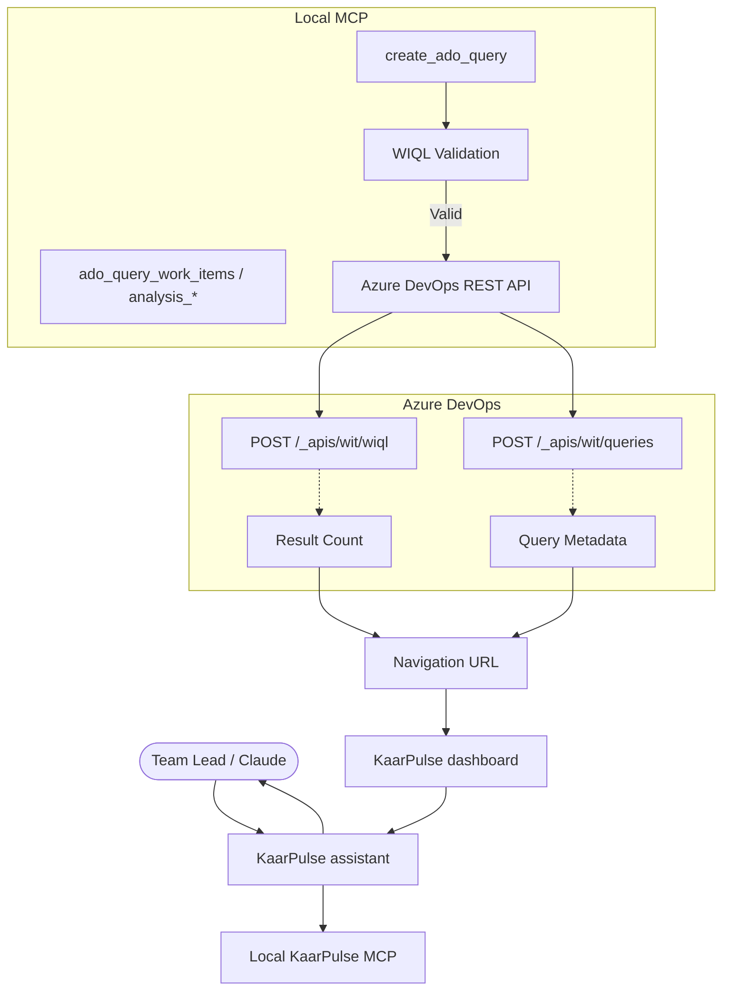

# KaarPulse

KaarPulse is an intelligent Team Lead decision-support assistant running via MCP. It connects to Azure DevOps and provides read-only analytical insights (plus optional saved-query creation) to help you identify risks, schedule variances, structural backlog issues, and unassigned work.

## Core Philosophy

- **Work items stay read-only.** KaarPulse never creates, updates, assigns or closes Azure DevOps work items.
- **Saved queries are allowed.** When a skill finds a category with more than three items, it creates or reuses a saved Boards query via `create_ado_query` and returns the real navigation URL.
- **Actionable visuals.** Outputs follow a dashboard: *what is happening → why it matters → what I recommend → what you can do next*, with query links as evidence.
- **Decision support.** Recommendations and options are generated; the Team Lead remains the decision maker.

## Skills

Skills are the core workflows that KaarPulse can run. You can invoke them using natural language. See [docs/skills.md](docs/skills.md).

### Core Governance & Health

- **`team-morning-brief`**: Morning command-center view and TL priority queue.
- **`project-health-analysis`**: Delivery, schedule, workload, backlog, dependencies, data quality, sprint — with *why*, not only a score.
- **`sprint-health-analysis`**: Current sprint progress, risks, and sprint-scoped queries.
- **`backlog-data-quality`**: Broad backlog governance (hierarchy, fields, dates, ownership, stale work, duplicates, dependencies, custom fields); one saved query per category with count > 3.
- **`schedule-variance-analysis`**: Planned vs actual duration, late starts and completions.
- **`hierarchy-health-analysis`**: Epic → Feature → Story → Task orphans and empty parents.
- **`dependency-analysis`**: Blocked work, chains, cross-team waits, highest-impact blocker.
- **`stale-work-analysis`**: Active work stale 7 / 14 / 30+ days.
- **`delivery-forecast`**: Honest outlook when history exists; otherwise explains why a forecast is unavailable.

### Productivity & Planning

- **`workload-analysis`**: Team workload distribution and capacity (not a performance ranking).
- **`deadline-risk-analysis`**: Overdue, due soon, missing dates, deadline risk categories.
- **`team-productivity-review`**: Throughput and trends without ranking people by task count.
- **`tl-productivity-review`**: Team Lead coverage and follow-through from the local audit trail.
- **`work-assignment-recommendation`**: Who could take an item — recommendation only, never an assignment.

### Communication

- **`team-email-assistant`**: Drafts emails from measured data; may attach a saved-query link; sends only after explicit confirmation.
- **`daily-team-report`**: Keepable daily dashboard with queries for large groups.
- **`weekly-team-review`**: Weekly planned vs actual, recurring problems, next-week actions.

## MCP Tools

### Azure DevOps Access (`ado_*`)
- `ado_get_project_overview`, `ado_get_project_teams`, `ado_get_team_members`
- `ado_get_work_item`, `ado_get_work_items`, `ado_query_work_items`
- `ado_get_work_item_fields`, `ado_get_field_mapping`
- `ado_get_blocked_items`, `ado_get_overdue_items`, sprint and backlog reads

### Analytics (`analysis_*`)
- `analysis_project_health`, `analysis_team_productivity`, `analysis_deadline_risk`
- `analysis_backlog_quality`, `analysis_schedule_variance`, `analysis_hierarchy_health`, `analysis_stale_work`
- Workload, assignment, dependency and daily-review composites

### Email
- `email_draft*` tools create a draft only
- `email_send_confirmed` sends after explicit confirmation

### Query Management (`create_ado_query`)

Creates a saved Azure DevOps Boards query from validated WIQL. Does not modify work items.

**Input (main fields):** `project` (optional, defaults to configured project), `queryName`, `queryDescription`, `wiql`, `columns`, `parentPath` (optional, defaults to `My Queries/KaarFlow`).

**Output:** `queryId`, `resultCount`, `fieldsIncluded`, `savedQueryUrl`, `navigationUrl`. If the title already exists, returns `QUERY_ALREADY_EXISTS` with `existingQueryUrl` / `savedQueryUrl` and `resultCount` for reuse.

See [docs/query-engine.md](docs/query-engine.md) and [docs/query-fields.md](docs/query-fields.md).

**Architecture:**

## Count > 3 rule

Skills group work items into categories. Categories with more than three items get a saved query and a clickable Open Query link. Smaller sets are listed in the chat.

## Security & Permissions

Analytical tools are read-only. `create_ado_query` is the only Azure DevOps write, and it writes query metadata only. Confirmed email sending is the only outbound message send. No PATs, secrets, or headers are exposed to the LLM.

## Getting Started

Ask "Show me the morning brief" or "Check backlog data quality" to see KaarPulse in action.

## Testing

- `npm test` — unit and MCP contract tests, including the skill catalogue.
- `npm run inspector` — MCP Inspector for live tool calls (overdue, missing dates, stale, unassigned, sprint, high priority, query create).
